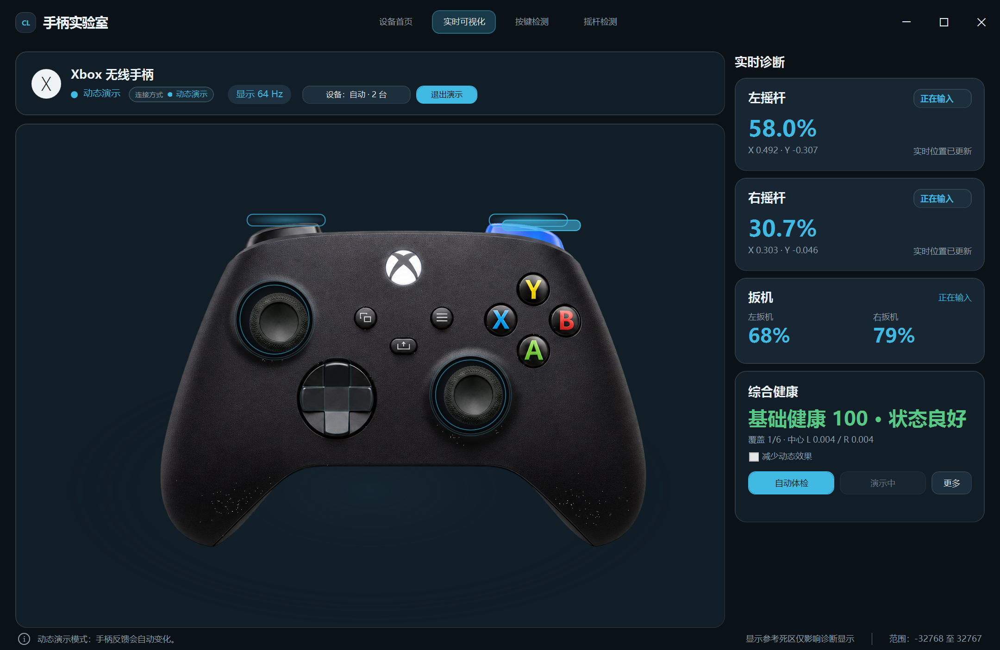
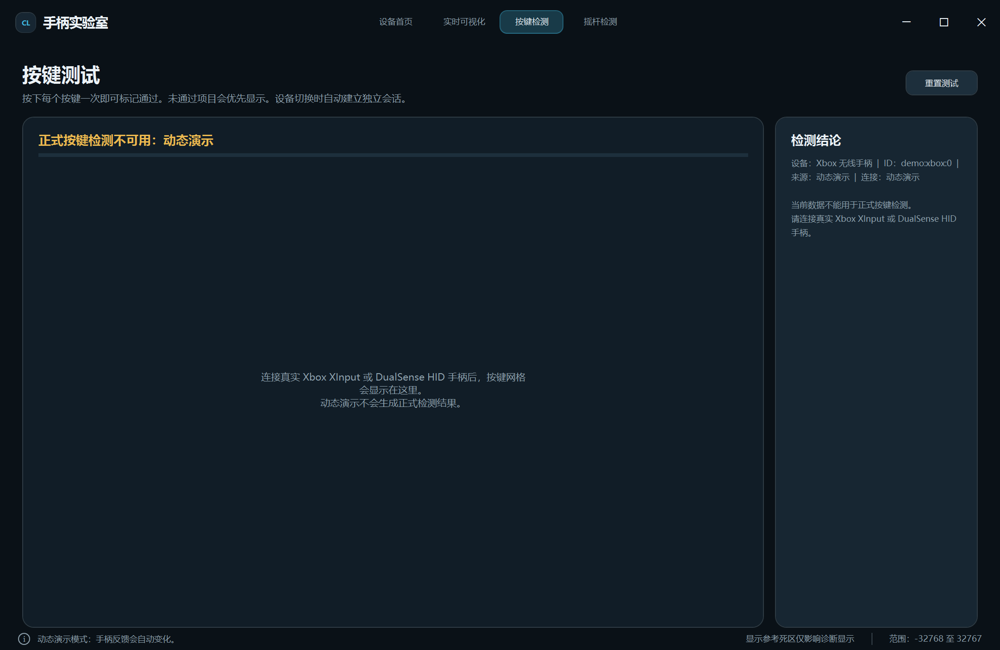
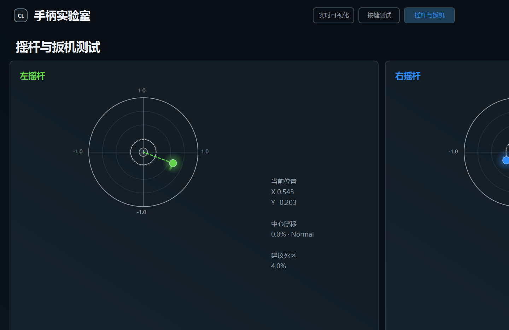

# ControllerLab（手柄实验室）

ControllerLab 是一个原生 Windows WPF 手柄检测与实时可视化工具。它将 Xbox 与 Sony DualSense 手柄统一到同一设备首页中，并提供实时输入反馈、按键测试、摇杆漂移与行程检测，以及面向图像底图的可视化校准工具。

> 当前工程面向 Windows x64，使用 .NET Framework 4.8 和原生 WPF；不依赖 WebView、HTML 或浏览器运行时。

## 功能

- 自动发现并切换多台在线手柄；设备断开和重新连接会实时更新。
- Xbox XInput 与 DualSense 原生 HID 输入统一映射到公共控制器状态。
- Xbox / DualSense 实时可视化：按键、十字键、摇杆、肩键与扳机反馈。
- Xbox 叠加层使用统一 1536×1024 逻辑舞台；支持区域校准 override，不会覆盖默认资源。
- 按键测试：记录真实按键是否已通过，并区分演示数据与真实设备输入。
- 摇杆与扳机检测：静止漂移采样、P95 漂移、建议死区、范围测试、轨迹与扳机历史曲线。
- DualSense 专属能力：原生 HID 状态通道、触摸板按压、扩展传感器/触点数据的兼容入口（仅在输入报告确实提供数据时显示）。
- 支持手柄导航：B 返回设备首页，LB/RB 切换页面，View + Menu 进入可用操作。

## 支持设备

| 设备 | 接入方式 | 当前能力 |
| --- | --- | --- |
| Xbox Wireless Controller / 兼容 XInput 手柄 | XInput | 实时输入、可视化、按键测试、摇杆和扳机检测 |
| Sony DualSense / DualSense Edge | 原生 HID（USB 或蓝牙，取决于系统报告） | 实时输入、专属可视化、按键测试、摇杆和扳机检测 |
| DUALSHOCK 4 | 原生 HID（兼容路径） | 基础识别与输入状态；完整功能需以实机报告为准 |

电量、触摸坐标和运动传感器取决于实际设备、驱动和连接模式；应用不会用演示数据伪造正式检测结果。

## 截图

### 实时可视化



### 按键测试



### 摇杆与扳机测试



## 编译

### Visual Studio

1. 安装 Visual Studio 2022（或支持 .NET Framework 4.8 的版本）和 **.NET desktop development** 工作负载。
2. 打开 `ControllerLab.sln`。
3. 选择 `Debug | x64` 或 `Release | x64`。
4. 生成并运行 `ControllerLab` 项目。

### PowerShell

在项目目录执行：

```powershell
./build.ps1
```

该脚本使用本机 .NET Framework WPF 编译工具链。构建输出会生成在 `bin/`，且已被 Git 忽略。

## 使用方法

1. 连接 Xbox 或 DualSense 手柄后启动 ControllerLab。
2. 在**设备首页**选择目标设备。
3. 打开**实时可视化**观察输入反馈；动态演示仅用于展示，不能替代真实检测。
4. 在**按键测试**逐一按下按键；只有真实输入会写入测试会话。
5. 在**摇杆检测**中先保持摇杆静止，执行漂移检测；然后可进行范围测试。
6. 如需微调 Xbox 覆盖层，可使用菜单中的校准入口。用户校准数据写入：
   `%LocalAppData%\ControllerLab\xbox-regions.override.json`，默认资源不会被修改。

## 项目结构

```text
ControllerLab/
├─ Assets/                         # 运行时图片、遮罩和区域配置
├─ Tools/                          # 离线区域生成/校准辅助工具
├─ docs/screenshots/               # README 截图
├─ ControllerLab.sln               # Visual Studio 解决方案
├─ ControllerLab.csproj            # WPF 项目
├─ ControllerLab.cs                # 应用与界面组合
├─ ControllerCore.cs               # 设备、输入与测试核心
├─ XboxOverlay.cs                  # Xbox 视觉覆盖层
├─ DualSenseMotion*.cs             # DualSense 运动可视化模块
└─ build.ps1                       # 本地构建脚本
```

## 校准与资源说明

- `Assets/xboxRegions.json`：Xbox 默认区域及遮罩锚点。
- `Assets/dualSenseRegions.json`：DualSense 默认区域数据。
- `Assets/LeftTopTriggerMask.png`、`Assets/RightTopTriggerMask.png`：Xbox 顶部左右共用真实图片 Mask。
- `Tools/GenerateDualSenseRegions` 和 `Tools/GenerateXboxTopRegions` 仅用于开发期离线处理，不作为运行时依赖。

## GitHub Release

建议首次标签使用 `v1.0.0`。本仓库默认发布**完整源码**；GitHub 在创建标签 Release 后会自动提供源码 ZIP/TAR 包。若要另行附带 Windows 可执行文件，请在 CI 或单独发布流程中构建，不要提交 `bin/`、`obj/` 或历史测试 EXE。

详细发布内容见 [RELEASE_NOTES.md](RELEASE_NOTES.md)。
