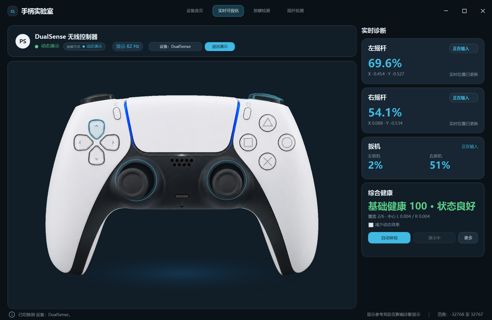
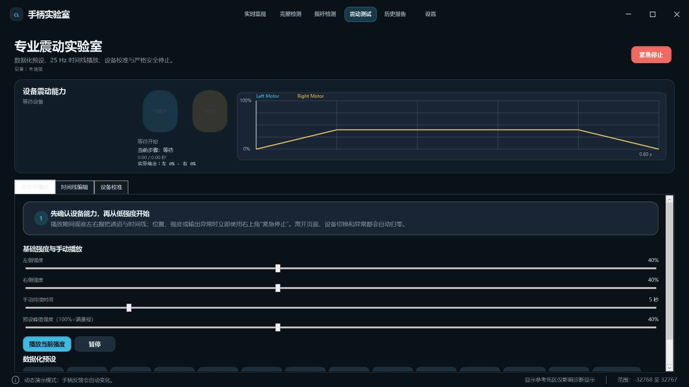

# ControllerLab（手柄实验室）

ControllerLab 是一个 Windows 原生 WPF 手柄检测与实时可视化工具。它在一个设备首页中管理 Xbox / XInput 与 Sony DualSense 输入，并提供实时反馈、按键测试、摇杆健康检测、扳机曲线、体感显示和受保护的震动测试。

> 当前工程面向 Windows x64 与 .NET Framework 4.8，使用代码式 WPF；不依赖 WebView、HTML、CSS 或浏览器运行时。

## 功能概览

- 自动发现和切换多个在线手柄；设备断开、重连时更新列表。
- Xbox XInput 与 DualSense 原生 HID 统一为公共控制器状态，UI 不直接读取底层报告。
- Xbox / DualSense 实时按键、D-pad、摇杆、肩键和扳机可视化。
- 按键测试、摇杆静止漂移 / 范围检测、建议死区和最近 5 秒 LT / RT 历史曲线。
- DualSense 高级检测页分为触摸板、陀螺仪、灯带与电量、自适应扳机：支持双指有界轨迹、24×12 覆盖图、五步触摸检测、静止校准、姿态融合和六轴诊断；未验证输出明确禁用。
- 专业震动实验室：Xbox 左右电机与 DualSense 基础双通道输出、14 个数据化预设、25 Hz 时间线、自定义预设、设备校准及紧急停止。
- “完整检测”向导按设备能力串联按键、十字键、摇杆、扳机、震动及可用的 DualSense 触摸板 / 陀螺仪检测，并生成健康评分。
- 健康报告保存为本地 JSON 与 Markdown，支持历史查看、删除、重新检测及 JSON / Markdown 导出。
- 手柄导航：B 返回设备首页，LB / RB 切换页面，View + Menu 进入可用操作。

动态演示和构造自检仅用于 UI / 逻辑验证，不会伪装为真实输入或写入正式检测结果。

## 截图

### Xbox 实时可视化


### DualSense / DS5 实时可视化



### 按键、摇杆与扳机检测


### 震动测试



## 支持设备与能力边界

| 设备 | 接入方式 | 已实现能力 | 重要限制 |
| --- | --- | --- | --- |
| Xbox Wireless Controller / 兼容 XInput 手柄 | XInput | 实时输入、可视化、按键 / 摇杆 / 扳机检测、双电机震动 | 电量、连接方式、Guide / Share 等能力受设备和驱动影响。 |
| Sony DualSense / DualSense Edge | 原生 HID（USB 或蓝牙） | 实时输入、专属可视化、按键 / 摇杆检测、触摸 / 运动解析、基础震动输出 | 触点 / 体感依赖完整报告；USB 与蓝牙震动输出仍待实机验证。 |
| DUALSHOCK 4 | 原生 HID 兼容路径 | 基础识别与输入状态 | 完整能力尚未承诺，须按实际报告验证。 |

完整矩阵和“已实现 / 已实机验证”的区别见 [docs/DEVICE_SUPPORT.md](docs/DEVICE_SUPPORT.md)。

## 编译

### Visual Studio

1. 安装 Visual Studio 2022（或支持 .NET Framework 4.8 的版本）及 **.NET desktop development** 工作负载。
2. 打开 `ControllerLab.sln`。
3. 选择 `Debug | x64` 或 `Release | x64`。
4. 生成并运行 `ControllerLab` 项目。

### PowerShell

在项目根目录运行：

```powershell
.\build.ps1 -OutputName ControllerLab.exe
```

当前项目没有 `PackageReference` 或 `packages.config`，所以没有独立 Restore 步骤。`build.ps1` 使用本机 .NET Framework 4.8 x64 WPF 编译器；构建输出与调试产物均由 `.gitignore` 忽略。

可执行自检命令和实机回归步骤见 [docs/TESTING.md](docs/TESTING.md)。

## 使用方法

1. 连接 Xbox / XInput 或 DualSense 手柄后启动程序。
2. 在**设备首页**选择目标设备。
3. 在**实时可视化**观察输入反馈；动态演示不能代替真实检测。
4. 在**按键检测**逐项按下按键；在**摇杆检测**中先松开摇杆再开始静止采样，并按提示完成范围测试。
5. 在 **DS 高级**页查看真实触摸轨迹、覆盖图、六轴原始量与姿态；灯带和自适应扳机在 USB / 蓝牙实机验证前保持禁用。
6. 在**震动测试**中从默认 `40% / 5 秒` 开始；可编辑 Left/Right 时间线、保存自定义预设或执行安全感知校准。震动运行期间不能进行静止漂移或陀螺仪静止校准。
7. 如需像素级微调 Overlay，使用应用内校准入口。用户 override 写入 LocalAppData，默认资源不会被覆盖。
8. 在顶部进入**完整检测**可运行分步健康向导；跳过项显示“未检测”且不参与评分，不支持项不会出现在设备的检测步骤中。

## 项目结构

```text
ControllerLab/
├─ Assets/                 # 底图、摇杆帽、Alpha Mask、区域与样式 JSON
├─ Tools/                  # 开发期离线区域生成与审核工具
├─ docs/                   # 维护文档和 README 截图
├─ ControllerLab.cs        # App、MainWindow、Raw Input、Sony HID、可视化组件
├─ ControllerCore.cs       # 统一状态、设备管理、按键 / 摇杆检测
├─ ControllerRumble.cs     # 统一震动服务、输出报告与安全控制
├─ RumbleProfessional.cs   # 能力、数据化预设、25 Hz 播放器、配置和校准
├─ RumbleStudioPage.cs     # 专业震动页、时间线曲线和节点编辑器
├─ ControllerHealth*.cs    # 完整检测向导、评分、报告存储和原生 WPF 页面
├─ Joystick*.cs            # 专业摇杆采样、分析、视图模型与单项页面
├─ DualSenseMotion*.cs     # 运动解析、校准、融合与姿态可视化
├─ DualSenseAdvanced*.cs   # 触摸/六轴分析、设备校准和四分区高级页
├─ XboxOverlay.cs          # Xbox Overlay、配置和校准
├─ ControllerLabTheme.cs   # 代码式 WPF 主题
├─ ControllerLab.sln       # Visual Studio 解决方案
├─ ControllerLab.csproj    # WPF 项目
└─ build.ps1               # 本机构建脚本
```

## 维护文档

- [项目当前状态](docs/PROJECT_STATUS.md)
- [架构与数据流](docs/ARCHITECTURE.md)
- [设备支持矩阵](docs/DEVICE_SUPPORT.md)
- [UI 与 Overlay 规则](docs/UI_RULES.md)
- [设计决策](docs/DECISIONS.md)
- [测试与回归](docs/TESTING.md)
- [DualSense 高级检测实现说明](DUALSENSE_ADVANCED_NOTES.md)
- [路线图](docs/ROADMAP.md)

## 当前限制

- DualSense 触点、运动、电量和输出能力必须按当前 USB / 蓝牙报告判定；不会用鼠标、演示或构造数据伪造结果。
- Xbox 及第三方兼容手柄的连接名称、电量和震动能力取决于 XInput / 驱动实现。
- 已校准的 Overlay 是稳定资产。普通 UI 调整不得改动其逻辑坐标、默认区域或真实 PNG Mask。
- 没有真实设备验证记录的能力在文档中均标为“已实现但待实机验证”。

## 路线图

近期方向包括完整检测实机可信度、震动实机验证、DualSense 高级检测和产品化收尾。详细完成标准和风险见 [docs/ROADMAP.md](docs/ROADMAP.md)。

## 许可证

当前仓库**尚未声明开源许可证**。在添加 `LICENSE` 文件前，请勿假设可自由再发布或修改。
